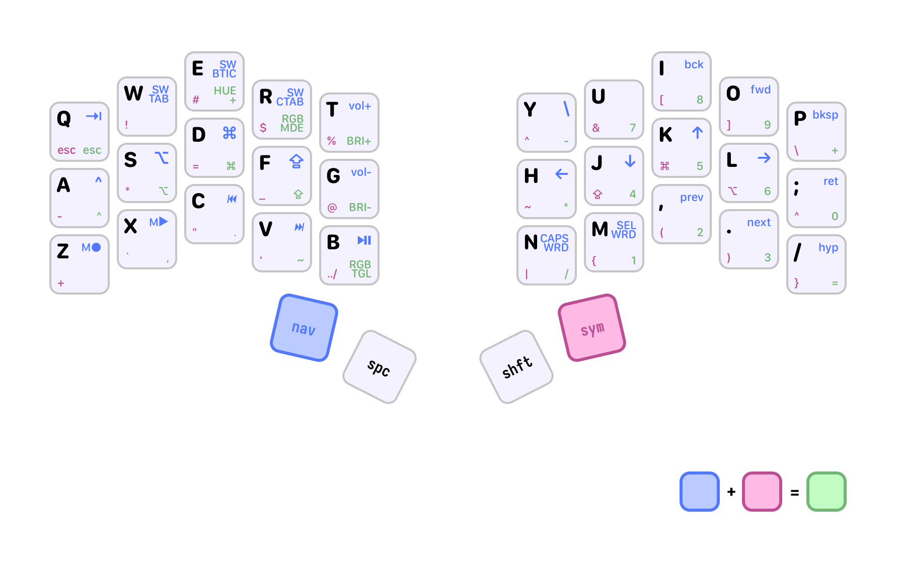

## Building

```bash
$ qmk compile users/mikker/keymaps/schweep.json -e CONVERT_TO=liatris -c
# builds to ~/qmk_firmware/.build
```

[Auroro Sweep build guider: Flashing Firmware](https://docs.splitkb.com/hc/en-us/articles/6330981035676-Aurora-Build-Guide-20-Flashing-Firmware)
